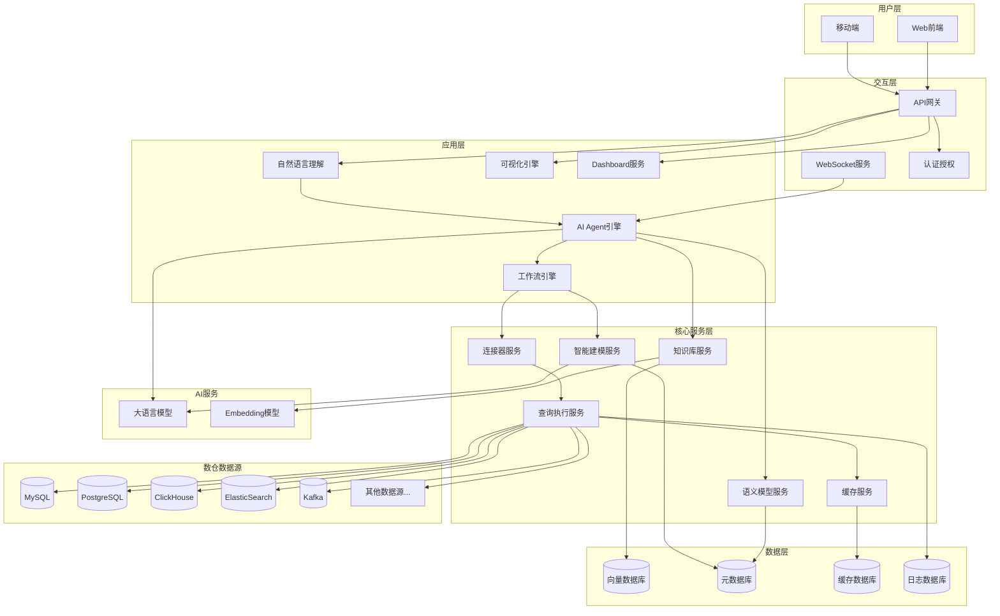

# Easy Data 系统设计文档

## 1. 项目概述

### 1.1 项目定位

Easy Data 致力于打造一个可以使用自然语言与数据对话的智能平台，让数据分析变得简单、直观、高效、直接。

**突破传统交互方式 All In AI**

Easy Data
革命性地改变了数据分析的交互模式。用户所有操作全部通过自然语言与系统交互，不再受限于传统的Web交互方式（如点击按钮、填写表单、选择下拉菜单等）。
用户只需用自然语言描述需求，系统即可理解并执行，真正实现了"说人话，做分析"的智能化体验。

### 1.2 核心目标

- **降低使用门槛**：用户不需要学习复杂的SQL或数据分析工具，使用自然语言即可完成数据分析
- **降低心智负担**：无需记忆表结构、字段含义等，系统自动理解并处理
- **直面最终用户**：业务人员可以直接使用，无需依赖技术人员
- **自然语言交互**：用户直接使用自然语言阐述分析目标，系统自动理解并执行，实现真正的对话式数据分析

### 1.3 核心价值

- **交互革命**：突破传统Web交互方式，所有操作通过自然语言完成，无需点击、选择、填写等传统操作
- **智能化**：基于大语言模型的智能理解与推理，准确理解用户意图
- **自动化**：自动SQL生成、自动数据建模、自动问题诊断，减少人工干预
- **可视化**：丰富的数据可视化展示，支持多种图表类型，智能推荐最适合的图表
- **可扩展**：支持多种数据源，灵活的架构设计，易于扩展新功能

## 2. 功能特性

### 2.1 革命性的自然交互

**突破传统Web交互方式的限制**

Easy Data 的核心创新在于彻底改变了用户与数据分析系统的交互方式。传统的Web应用需要用户：

- 点击各种按钮和菜单
- 填写复杂的表单
- 在下拉菜单中选择选项
- 记忆各种功能的位置和操作流程
- 学习系统的使用方法和操作规范

Easy Data 完全摒弃了这些传统交互方式，用户只需：

- **用自然语言描述需求**：如"帮我分析一下上个月的销售情况"
- **通过对话完成所有操作**：如"按地区分组"、"改成折线图"、"导出Excel"
- **无需学习任何操作**：系统自动理解用户意图，智能执行相应操作
- **支持多轮对话**：可以追问、澄清、优化，就像与真人对话一样

### 2.2 丰富的数据库支持

系统支持以下数据源连接：

**关系型数据库：**

- MySQL
- PostgreSQL
- SQL Server
- Oracle
- DB2
- GaussDB
- Dameng（达梦）
- OceanBase

**分析型数据库：**

- ClickHouse
- Doris
- Hive

**NoSQL数据库：**

- ElasticSearch

**流式数据：**

- Kafka（实时分析）

### 2.3 核心功能模块

#### 2.3.1 自然语言查询

- 支持多轮对话，理解上下文
- 自动生成SQL查询语句
- 智能查询优化
- 查询结果解释

#### 2.3.2 智能数据建模

- 自动发现数据表结构
- 自动构建语义模型
- 自动识别维度、度量、时间字段
- 支持自定义业务指标

#### 2.3.3 可视化分析

- 多种图表类型（柱状图、折线图、饼图、散点图、热力图等）
- 交互式Dashboard
- 数据钻取和下钻
- 报表导出

#### 2.3.4 智能分析流程

- 预定义分析模板
- 自定义分析流程
- 运维场景标准流程（日志+指标+告警联合分析）

#### 2.3.5 系统自健康

- 自动问题检测
- 自动修复建议
- 系统健康监控
- 性能优化建议

## 3. 系统架构

### 3.1 整体架构图



### 3.2 分层架构设计

#### 3.2.1 用户交互层

**职责：**

- 提供以自然语言对话为核心的交互界面（Web和移动端）
- 处理用户输入的自然语言，支持多轮对话
- 展示查询结果和可视化图表
- 管理用户会话和对话历史

**交互创新：**

- **纯自然语言交互**：用户无需学习界面操作，所有功能通过自然语言描述即可完成
- **对话式体验**：支持多轮对话，系统理解上下文，可以追问、澄清、优化
- **零学习成本**：告别传统的表单填写、按钮点击、菜单选择等复杂操作
- **智能引导**：系统主动理解用户意图，提供智能建议和引导

#### 3.2.2 API网关层

**职责：**

- 统一API入口
- 请求路由和负载均衡
- 认证授权
- 限流熔断
- 日志记录

#### 3.2.3 应用服务层

**3.2.3.1 自然语言理解服务（NLU）**

**职责：**

- 解析用户自然语言输入
- 提取查询意图
- 识别实体和参数
- 多轮对话上下文管理

**核心功能：**

- 意图识别
- 实体抽取
- 槽位填充
- 上下文理解

**3.2.3.2 AI Agent引擎**

**职责：**

- 协调各个服务完成用户请求
- 执行工作流
- 决策和推理
- 错误处理和重试

**工作流类型：**

- **ReAct模式**：推理-行动循环
    - 思考（Think）：分析当前情况
    - 行动（Act）：执行具体操作
    - 观察（Observe）：获取结果并反馈

- **Reflection模式**：自我反思和优化
    - 执行任务
    - 评估结果
    - 反思问题
    - 优化方案

- **Plan模式**：规划执行
    - 制定计划
    - 分解任务
    - 执行步骤
    - 验证结果

**3.2.3.3 工作流引擎**

**职责：**

- 管理工作流定义
- 执行工作流实例
- 任务调度
- 状态管理

**3.2.3.4 可视化引擎**

**职责：**

- 图表类型推荐
- 图表配置生成
- 数据格式转换
- 图表渲染

**支持的图表类型：**

- 基础图表：柱状图、折线图、饼图、散点图
- 高级图表：热力图、树状图、桑基图、关系图
- 地理图表：地图、3D地图
- 动态图表：实时数据流、动画效果

**3.2.3.5 Dashboard服务**

**职责：**

- Dashboard创建和编辑
- 图表布局管理
- 数据刷新策略
- 分享和权限控制

#### 3.2.4 核心服务层

**3.2.4.1 知识库服务**

**架构：**

```
知识库
├── 语义模型
│   ├── 表结构信息（表名、字段、类型）
│   ├── 字段语义（含义、业务描述）
│   ├── 维度信息（维度字段、层级关系）
│   ├── 度量信息（度量字段、聚合方式）
│   ├── 时间字段（时间维度、时间粒度）
│   └── 指标定义（业务指标、计算公式）
├── 业务知识
│   ├── 公共知识（行业规范、数仓建模规范）
│   └── 私域知识（企业特有业务知识）
└── 最佳实践
    ├── 查询模板
    ├── 分析流程
    └── 优化建议
```

**存储方式：**

- 向量数据库：存储语义向量，支持相似度搜索
- 关系数据库：存储结构化元数据

**3.2.4.2 语义模型服务**

**职责：**

- 语义模型的构建和维护
- 自动发现数据表结构
- 自动识别字段语义
- 语义模型版本管理

**语义模型结构：**

```json

```

**3.2.4.3 智能建模服务**

**职责：**

- 自动构建数据仓库模型
- 生成维度表和事实表
- 优化数据模型结构

**建模流程：**

1. 分析源数据表结构
2. 识别业务实体和关系
3. 设计星型/雪花型模型
4. 分析DDL脚本
5. 生成语义元数据

**3.2.4.4 连接器服务**

**职责：**

- 管理数据源连接配置
- 连接池管理
- SQL执行
- 结果集处理
- 查询优化

**连接器架构：**

```
连接器服务
├── 连接管理器
│   ├── 连接池
│   ├── 连接健康检查
│   └── 连接复用
├── SQL执行器
│   ├── SQL解析
│   ├── SQL优化
│   ├── 执行计划
│   └── 结果缓存
└── 适配器层
    ├── MySQL适配器
    ├── PostgreSQL适配器
    ├── ClickHouse适配器
    └── ...
```

**3.2.4.5 查询执行服务**

**职责：**

- 接收查询请求
- 查询计划生成
- 查询执行
- 结果缓存
- 查询日志记录

**查询执行流程：**

1. 接收查询请求
2. 检查缓存
3. 生成执行计划
4. 执行查询
5. 结果处理
6. 缓存结果
7. 返回结果

**3.2.4.6 缓存服务**

**职责：**

- 查询结果缓存
- 元数据缓存
- 会话缓存
- 缓存策略管理

**缓存策略：**

- **TTL缓存**：基于时间的过期策略
- **LRU缓存**：最近最少使用策略
- **智能缓存**：基于查询频率和结果大小
