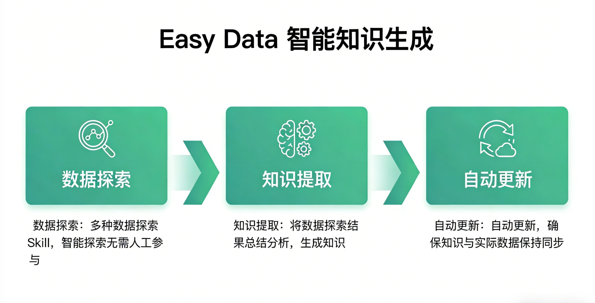
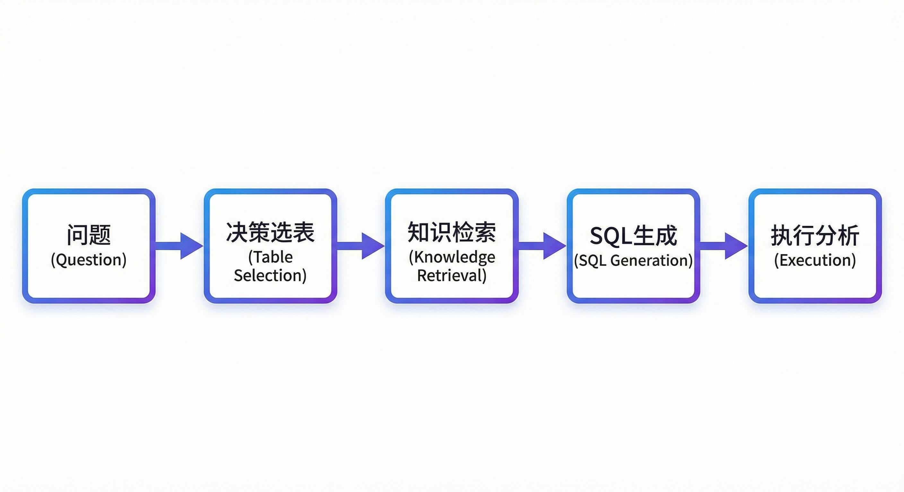

# NL2SQL总是"翻车"？Easy Data用这招让AI真正读懂你的数据库

## 开篇：一个让人抓狂的真实场景

产品经理小王兴冲冲地部署了一套NL2SQL系统，演示时问"上个月销售额是多少"，AI完美回答。结果第二天业务同事问"华东区上月营收趋势"，系统直接懵了——因为数据库里字段叫`amt`不是`revenue`，表名是`order_log`不是`sales`。

这不是个例。很多团队发现：**NL2SQL在Demo里很美，一到生产环境就"翻车"**。问题出在哪？

---

## 核心问题：AI其实"看不懂"你的数据库

打个比方：数据库就像一座图书馆，Schema只是书架上的标签——写着"经济类"，但书里到底讲什么，标签不会告诉你。

传统方案有两个流派，各有各的坑：

**流派一：直接读Schema**
- 字段名是`amt`，Comment为空，AI怎么知道这是"金额"还是"数量"？
- 更糟的是，很多Comment还是三年前写的，早就和实际业务对不上了

**误区**："大模型够强，Schema就够了"——现实是：再强的模型也猜不出`user_type`存的是"会员等级"而不是"用户类型"

**流派二：RAG知识库**
- 需要人工维护知识库，一个中型数仓可能要搞几个月
- 而且数据库天天变，知识库更新永远跟不上

**误区**："RAG能解决一切"——RAG的检索精度对短文本（列名）效果有限，多表JOIN的复杂逻辑，检索模块根本推理不出来

**本质上，两种方案都在用"静态信息"去理解"动态数据"，这注定是个死胡同。**

---

## Easy Data的解法：让AI自己"读"数据

Easy Data换了个思路：**与其让人告诉AI数据库里有什么，不如让AI自己去探索数据**。

就像一个新来的数据分析师，不会只看表结构文档，而是会：
- 看看`amt`字段里存的都是什么数（哦，是金额，范围0.01-99999.99）
- 看看有没有空值（只有0.1%，数据质量不错）
- 看看和其他字段的关联（和`order_id`一一对应，是订单金额）



这就是Easy Data的**智能知识生成**能力：
1. **自动探索**：内置数据探索Skill，像人一样分析数据
2. **自动生成知识**：字段含义、数据分布、业务规则、关联关系
3. **自动更新**：定时扫描，知识永远和数据同步

**成本对比**：传统RAG要几个月人工构建，Easy Data几小时自动完成。

当然，Easy Data也有自己的挑战：
- 数据探索需要执行SQL，对大表要有采样策略
- 特殊业务规则仍需人工补充（但只是补充，不是从零构建）

---

## 技术原理：ReAct智能体的两步精准打击

现在我们有了实时精准知识，怎么用好它？Easy Data设计了**ReAct智能体流程**：

**第一步：智能决策**
用户问"上个月各地区销售情况"，智能体先看Summary总索引，判断需要`order_info`和`region_info`两张表，排除无关表干扰。

**第二步：精准生成**
再读这两张表的明细知识，知道`order_amt`是订单金额、`region_name`是地区名称、JOIN条件是什么，然后生成SQL。

```sql
SELECT r.region_name, SUM(o.order_amt) as total_sales
FROM order_info o
JOIN region_info r ON o.region_id = r.id
WHERE o.order_date >= '2024-01-01' 
  AND o.order_date < '2024-02-01'
GROUP BY r.region_name
```



---

## 总结与建议

Easy Data的核心创新在于：**用AI分析数据，生成AI能理解的知识**，形成闭环。

**如果你也在做NL2SQL，建议：**

1. **别只盯着Schema**：字段名和Comment远远不够
2. **别迷信RAG**：知识库构建和维护成本可能超乎想象
3. **试试数据探索**：让AI自己"看"数据，比人告诉它更准确
4. **知识要分层**：Summary做决策，Detail做生成，各司其职

**Easy Data已开源，欢迎体验"让数据分析变得简单"的感觉。**

https://github.com/wangdisdu/easy-data

---

