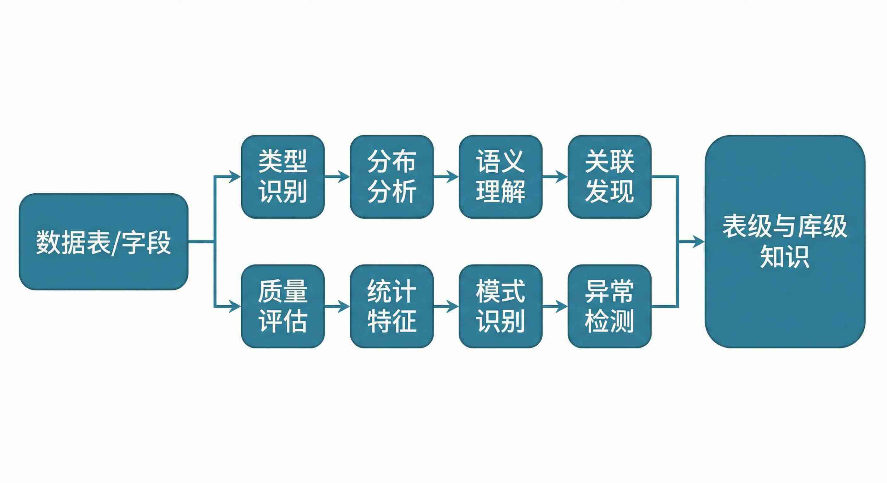
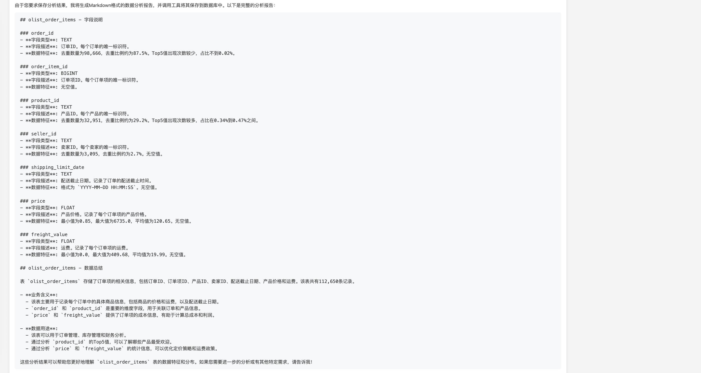

# 让AI真正"读懂"你的数据：Easy Data 的 8 种数据探索 Skill

## 开篇：为什么 Schema 和 RAG 都不够用？

做 NL2SQL 的同行都踩过坑：只给大模型看表结构，字段叫 `amt`、Comment 还是空的，模型猜不出是「金额」还是「数量」；上 RAG 知识库又要人工维护几个月，库一改版知识就过期。**本质是：用「静态描述」理解「活数据」，信息永远差一口气。**

Easy Data 换了个思路：**让 AI 自己「读」数据**——像数据分析师一样看样本、看分布、看关联。为此内置了 8 种数据探索 Skill，把「读数据」自动化、结构化。

---

## 核心概念：8 种数据探索 Skill

可以理解成**给 AI 用的 8 种「体检项目」**，每张表、每个字段跑一遍，就产出机器和人都能用的知识：

1. **字段类型识别**：数值、文本、日期等  
2. **数据分布分析**：唯一值、空值比例等  
3. **业务语义理解**：从数据内容推断含义（如 0.01～99999.99 → 金额）  
4. **关联关系发现**：表与表怎么连  
5. **数据质量评估**：完整性、是否可放心用  
6. **统计特征提取**：最大/最小/均值等  
7. **模式识别**：规律与模式（如日期是否连续）  
8. **异常检测**：离群点、脏数据  

由**数据分析智能体**自动调度：定时扫库、执行探索、写回知识。传统 RAG 数月建库，Easy Data 几小时可产出库内知识。

> 注：一些特殊的私域知识或者数据库没有的知识仍需人工补充，比如企业内部的组织架构等。

---

## 技术原理简述

三步走：**自动探索**（智能体对表/字段调用 8 类 Skill，大表做采样）→ **知识沉淀**（整理成字段含义、范围、空值、业务规则、关联）→ **自动更新**（定时检测变更并更新知识）。知识分层：**Summary** 先选表，**Detail** 再写 SQL，既省 token 又提准确率。

---

## 知识长什么样？

下面是利用Spider 2.0（企业级Text2SQL）的数据集探索后获得的知识：

可以看到Easy Data借助数据探索 Skill总结的知识比大多人维护的更加精准有效

## 常见误区与挑战

- **误区一**：「大模型够强，给 Schema 就行。」——再强也猜不准 `user_type` 存的是「会员等级」还是「用户类型」，**业务语义得从数据里学**。  
- **误区二**：「RAG 一劳永逸。」——知识库要维护，列名等短文本检索效果有限，多表 JOIN 单靠检索难推理。**数据探索是在源头把正确知识建好**。  
- **挑战**：探索要跑 SQL，大表需**采样与限流**；特殊业务规则可**人工补充**（补充为主，不是从零建库）。

---

## 总结与行动建议

8 种数据探索 Skill 解决的是「**让 AI 真正读懂数据**」：不依赖残缺 Schema，也不依赖高成本、易过期的人工知识库，用**自动、可更新**的探索生成准确、实时的库内知识。

**建议：** ① 别只押注 Schema；② 评估「谁在维护知识」、能否跟上库变更；③ 尝试「先读数据再生成 SQL」；④ 知识分层（总索引选表 + 明细生成）。Easy Data 已开源，欢迎体验。

