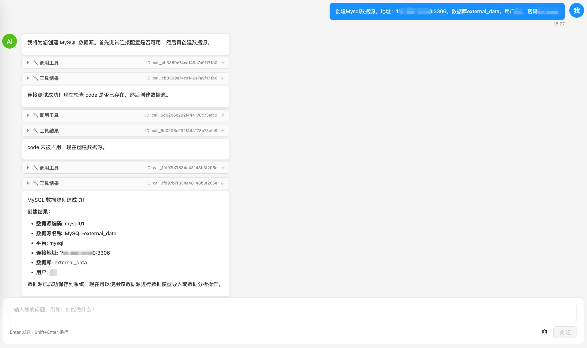

# All In AI：更懂你的新交互方式

当你使用一个新系统时，你是否也遇到过这些困境：

- **使用前先「上学」**：动辄要花几周甚至几个月参加培训，记住各种概念、菜单和操作流程，心智负担从第一天就压上来。
- **学习成本高**：想用好系统，得先啃文档；操作时动不动就要翻厚厚的用户手册。
- **一出问题更头疼**：连不上库、导不对表、查不出数……每遇到一次，就要查 FAQ、搜工单、对着一堆资料自己排查，时间都耗在「搞懂怎么操作」上。
- **操作路径长**：一个需求往往要跨多个页面、多点几次才能完成。
- **容易出错**：表单项多，填错一处就可能连不上、导不对。

对做 AI 产品和开发的同行来说，这种交互还有一层隐性成本：**大量时间花在「操作界面」和「查文档」上，而不是「想清楚要什么」**。需求本身并不复杂，复杂的是让机器听懂并执行的那条路径。

---

## All In AI：对话即操作

AI 时代，很多传统软件已经尝试接入 AI 做改造，但体系已经定型，**旧负担太重**，做出满意的效果太难。

**Easy Data 从系统设计之初就在考虑这件事**。专门为 **All In AI** 设计：对话不是附加功能，而是主入口；智能体不是外挂，而是核心能力。

你不需要在菜单和表单里「找」和「点」，只需要**说清楚你要什么**，平台会交给智能体与自然语言来承接：

| 你想做的事   | 传统方式                         | Easy Data 的方式 |
|--------------|----------------------------------|-------------------|
| 创建数据源   | 菜单 → 表单 → 类型 → 参数 → 测试 | 一句话：「帮我创建一个 MySQL 数据源，地址 192.168.1.100，端口 3306」 |
| 导入数据模型 | 选数据源 → 扫描 → 选表 → 配置    | 「从销售库导入所有订单相关的表」 |
| 查数据       | 写 SQL → 执行 → 自己分析         | 「查询上个月销售额前 10 的产品」 |

背后是一套**智能体矩阵**在协作：主智能体理解意图并分工，众多子智能体各司其职。你只负责「说」，剩下的由 AI 解决。

带来的变化很直接：**操作时间变短、学习成本变低、误操作变少**，精力可以更多放在「要什么结果」而不是「怎么点界面」。

---

## 实际应用：一句话能做什么？

用两个典型场景，帮你直观感受「对话即操作」能省多少事。

**场景一：新建数据源**

- **传统方式**：在「数据源管理」里点「新增」→ 选 MySQL → 填主机、端口、用户名、密码、库名 → 点「测试连接」→ 保存。
- **现在**：在对话框里输入一句——  
  **「帮我创建一个 MySQL 数据源，地址 192.168.1.100，端口 3306，库名 sales。」**  
  系统自动完成创建与校验。

**场景二：遇到问题，交给 AI 解决**

传统方式下一出问题，就要查 FAQ、搜工单、对着一堆资料自己排查。在 Easy Data 里，你可以**直接对系统说**：「为什么连不上这个数据源？」「最近查询为什么变慢了？」  
系统会由智能体（如系统健康智能体）自动检查连接状态、分析日志、诊断原因，并给出可执行的建议，甚至自动修复。从「自己翻文档找答案」变成「问一句，让 AI 帮你查、帮你答」。

---

## 传统方式还在，你可以按习惯选

需要说明的是：**我们并没有拿掉传统的菜单和表单**。  
如果你或团队已经习惯在各类菜单里点点选选，这些入口都会保留；**对话式交互是新增的一条「更短路径」**，适合想少点几步、多用自然语言的场景。你可以先用在最痛的那几类操作上，再慢慢扩大使用范围。

---
